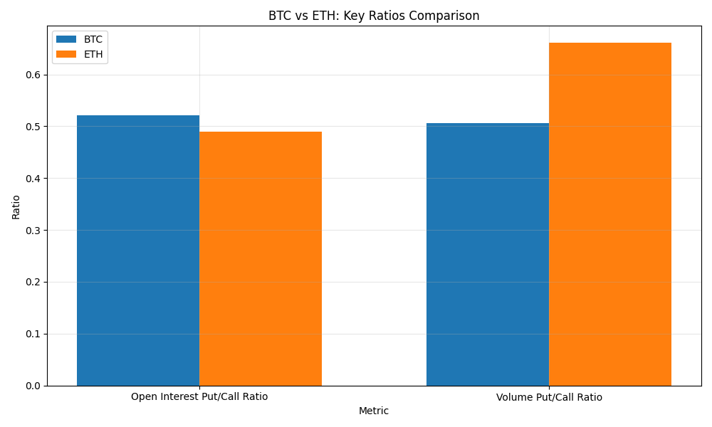

# Consolidated Crypto Options Summary - 2025-03-16

## Overview

This report provides a consolidated view of options data for Bitcoin (BTC) and Ethereum (ETH).

## Summary Statistics

| Metric | BTC | ETH |
|--------|-----|-----|
| Current Price | $84,124.77 | $1,920.53 |
| Total Open Interest | 294,140 | 2,113,598 |
| Calls Open Interest | 193,424 | 1,419,179 |
| Puts Open Interest | 100,717 | 694,419 |
| Put/Call Ratio | 0.52 | 0.49 |
| Total Volume | 4,908 | 24,342 |
| Calls Volume | 3,260 | 14,659 |
| Puts Volume | 1,649 | 9,683 |
| Volume Put/Call Ratio | 0.51 | 0.66 |

## Comparison Charts

### BTC vs ETH: Key Ratios Comparison

---

Report generated on 2025-03-16 16:36:03
