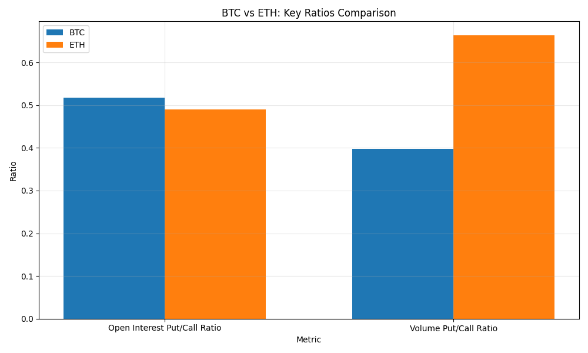
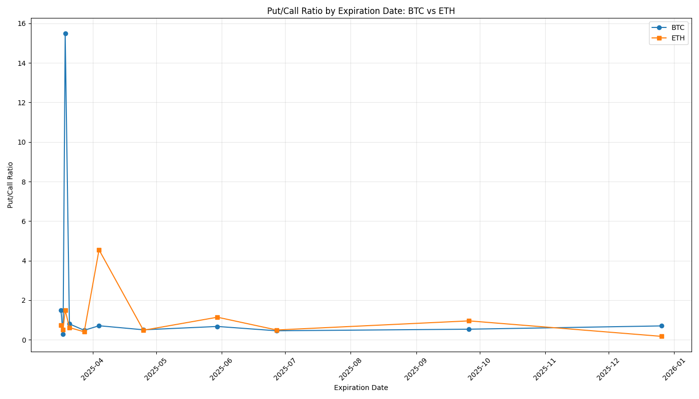

# Consolidated Crypto Options Summary - 2025-03-16

## Overview

This report provides a consolidated view of options data for Bitcoin (BTC) and Ethereum (ETH).

## Summary Statistics

| Metric | BTC | ETH |
|--------|-----|-----|
| Current Price | $84,258.33 | $1,922.03 |
| Total Open Interest | 292,019 | 2,113,608 |
| Calls Open Interest | 192,482 | 1,419,185 |
| Puts Open Interest | 99,536 | 694,423 |
| Put/Call Ratio | 0.52 | 0.49 |
| Total Volume | 3,657 | 24,283 |
| Calls Volume | 2,616 | 14,602 |
| Puts Volume | 1,041 | 9,681 |
| Volume Put/Call Ratio | 0.40 | 0.66 |

## Comparison Charts

### BTC vs ETH: Key Ratios Comparison

### Put/Call Ratio by Expiration Date

## High Volume Strikes

### BTC High Volume Strikes

| Strike | Volume | Distance from Current Price |
|--------|--------|----------------------------|
| $86,000 | 699 | 2.07% |
| $90,000 | 286 | 6.81% |
| $94,000 | 244 | 11.56% |
| $85,000 | 236 | 0.88% |
| $84,000 | 210 | -0.31% |

### ETH High Volume Strikes

| Strike | Volume | Distance from Current Price |
|--------|--------|----------------------------|
| $2,200 | 2,197 | 14.46% |
| $1,950 | 2,166 | 1.46% |
| $1,900 | 2,097 | -1.15% |
| $2,000 | 1,780 | 4.06% |
| $1,925 | 1,261 | 0.15% |

## Put/Call Ratio by Expiration

### BTC Put/Call Ratio by Expiration

| Expiration Date | Put/Call Ratio |
|-----------------|----------------|
| 2025-03-17 | 1.48 |
| 2025-03-18 | 0.27 |
| 2025-03-19 | 15.50 |
| 2025-03-21 | 0.80 |
| 2025-03-28 | 0.48 |
| 2025-04-04 | 0.71 |
| 2025-04-25 | 0.50 |
| 2025-05-30 | 0.67 |
| 2025-06-27 | 0.45 |
| 2025-09-26 | 0.53 |
| 2025-12-26 | 0.70 |

### ETH Put/Call Ratio by Expiration

| Expiration Date | Put/Call Ratio |
|-----------------|----------------|
| 2025-03-17 | 0.75 |
| 2025-03-18 | 0.52 |
| 2025-03-19 | 1.50 |
| 2025-03-21 | 0.61 |
| 2025-03-28 | 0.40 |
| 2025-04-04 | 4.55 |
| 2025-04-25 | 0.48 |
| 2025-05-30 | 1.14 |
| 2025-06-27 | 0.49 |
| 2025-09-26 | 0.95 |
| 2025-12-26 | 0.17 |

---

Report generated on 2025-03-16 18:06:08
