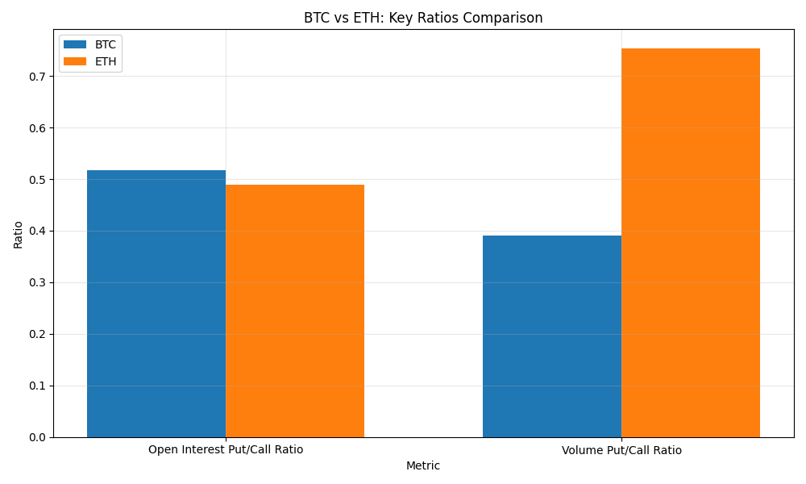
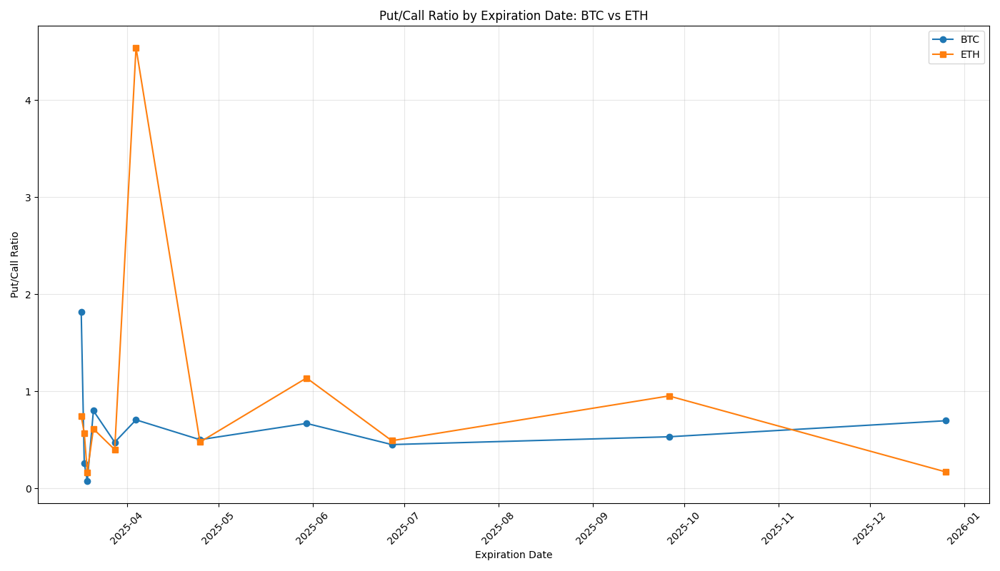

# Consolidated Crypto Options Summary - 2025-03-16

## Overview

This report provides a consolidated view of options data for Bitcoin (BTC) and Ethereum (ETH).

## Summary Statistics

| Metric | BTC | ETH |
|--------|-----|-----|
| Current Price | $83,923.63 | $1,911.13 |
| Total Open Interest | 292,200 | 2,114,968 |
| Calls Open Interest | 192,583 | 1,419,902 |
| Puts Open Interest | 99,618 | 695,066 |
| Put/Call Ratio | 0.52 | 0.49 |
| Total Volume | 3,790 | 22,940 |
| Calls Volume | 2,726 | 13,088 |
| Puts Volume | 1,065 | 9,852 |
| Volume Put/Call Ratio | 0.39 | 0.75 |

## Comparison Charts

### BTC vs ETH: Key Ratios Comparison

### Put/Call Ratio by Expiration Date

## High Volume Strikes

### BTC High Volume Strikes

| Strike | Volume | Distance from Current Price |
|--------|--------|----------------------------|
| $87,000 | 483 | 3.67% |
| $86,000 | 412 | 2.47% |
| $90,000 | 305 | 7.24% |
| $94,000 | 232 | 12.01% |
| $83,000 | 173 | -1.10% |

### ETH High Volume Strikes

| Strike | Volume | Distance from Current Price |
|--------|--------|----------------------------|
| $1,950 | 1,729 | 2.03% |
| $1,900 | 1,548 | -0.58% |
| $1,000 | 1,348 | -47.67% |
| $2,000 | 1,275 | 4.65% |
| $1,925 | 1,258 | 0.73% |

## Put/Call Ratio by Expiration

### BTC Put/Call Ratio by Expiration

| Expiration Date | Put/Call Ratio |
|-----------------|----------------|
| 2025-03-17 | 1.82 |
| 2025-03-18 | 0.26 |
| 2025-03-19 | 0.07 |
| 2025-03-21 | 0.80 |
| 2025-03-28 | 0.48 |
| 2025-04-04 | 0.71 |
| 2025-04-25 | 0.50 |
| 2025-05-30 | 0.67 |
| 2025-06-27 | 0.45 |
| 2025-09-26 | 0.53 |
| 2025-12-26 | 0.70 |

### ETH Put/Call Ratio by Expiration

| Expiration Date | Put/Call Ratio |
|-----------------|----------------|
| 2025-03-17 | 0.75 |
| 2025-03-18 | 0.57 |
| 2025-03-19 | 0.17 |
| 2025-03-21 | 0.61 |
| 2025-03-28 | 0.40 |
| 2025-04-04 | 4.54 |
| 2025-04-25 | 0.48 |
| 2025-05-30 | 1.14 |
| 2025-06-27 | 0.49 |
| 2025-09-26 | 0.95 |
| 2025-12-26 | 0.17 |

---

Report generated on 2025-03-16 18:06:24
