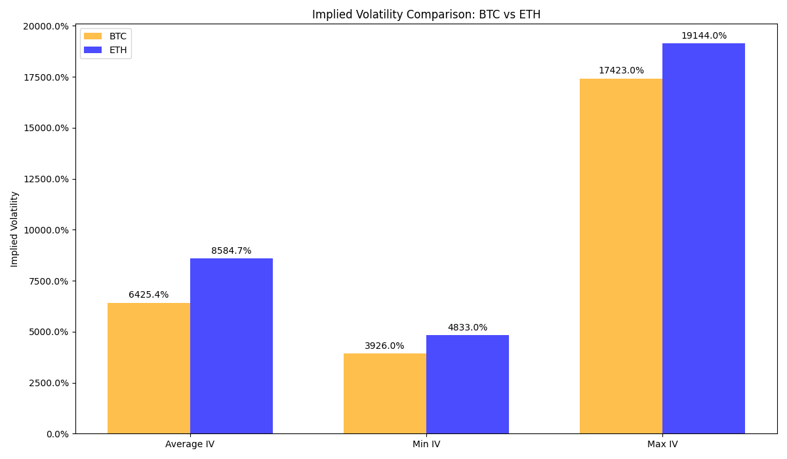
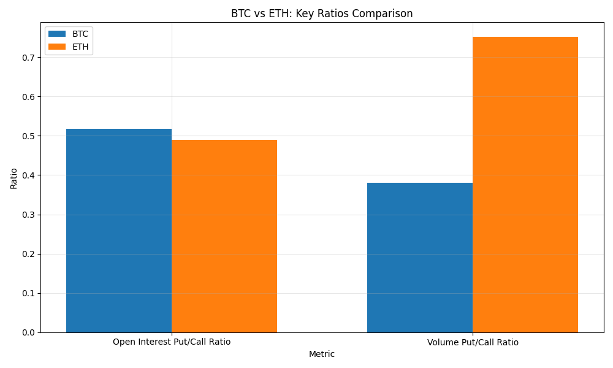
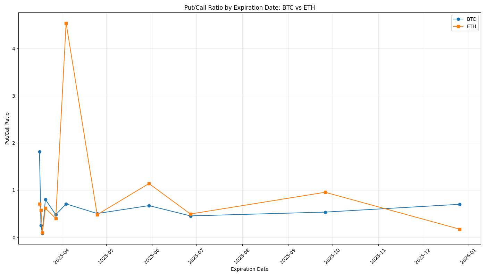

# Consolidated Crypto Options Summary - 2025-03-16

## Overview

This report provides a consolidated view of options data for Bitcoin (BTC) and Ethereum (ETH).

## Summary Statistics

| Metric | BTC | ETH |
|--------|-----|-----|
| Current Price | $83,749.87 | $1,908.15 |
| Total Open Interest | 292,277 | 2,115,924 |
| Calls Open Interest | 192,644 | 1,420,663 |
| Puts Open Interest | 99,633 | 695,261 |
| Put/Call Ratio | 0.52 | 0.49 |
| Total Volume | 3,848 | 22,902 |
| Calls Volume | 2,786 | 13,077 |
| Puts Volume | 1,062 | 9,825 |
| Volume Put/Call Ratio | 0.38 | 0.75 |
| Average IV | 6425.39% | 8584.71% |
| Min IV | 3926.00% | 4833.00% |
| Max IV | 17423.00% | 19144.00% |

## Implied Volatility Analysis

Implied volatility (IV) represents the market's expectation of future price movement and volatility. Higher IV indicates greater expected price movement and typically higher option premiums.

- **BTC Average IV**: 6425.39%
- **ETH Average IV**: 8584.71%

The IV spread between different strikes indicates market sentiment about potential price directions. A higher IV for out-of-the-money puts compared to calls suggests a bearish skew, while the opposite suggests a bullish skew.

### BTC vs ETH: Implied Volatility Comparison

## Comparison Charts

### BTC vs ETH: Key Ratios Comparison

### Put/Call Ratio by Expiration Date

## High Volume Strikes

### BTC High Volume Strikes

| Strike | Volume | Distance from Current Price |
|--------|--------|----------------------------|
| $87,000 | 485 | 3.88% |
| $86,000 | 416 | 2.69% |
| $90,000 | 328 | 7.46% |
| $94,000 | 232 | 12.24% |
| $85,000 | 182 | 1.49% |

### ETH High Volume Strikes

| Strike | Volume | Distance from Current Price |
|--------|--------|----------------------------|
| $1,950 | 1,721 | 2.19% |
| $1,900 | 1,553 | -0.43% |
| $1,000 | 1,348 | -47.59% |
| $1,925 | 1,341 | 0.88% |
| $2,200 | 1,239 | 15.29% |

## Put/Call Ratio by Expiration

### BTC Put/Call Ratio by Expiration

| Expiration Date | Put/Call Ratio |
|-----------------|----------------|
| 2025-03-17 | 1.82 |
| 2025-03-18 | 0.25 |
| 2025-03-19 | 0.08 |
| 2025-03-21 | 0.80 |
| 2025-03-28 | 0.48 |
| 2025-04-04 | 0.71 |
| 2025-04-25 | 0.50 |
| 2025-05-30 | 0.67 |
| 2025-06-27 | 0.45 |
| 2025-09-26 | 0.53 |
| 2025-12-26 | 0.70 |

### ETH Put/Call Ratio by Expiration

| Expiration Date | Put/Call Ratio |
|-----------------|----------------|
| 2025-03-17 | 0.71 |
| 2025-03-18 | 0.57 |
| 2025-03-19 | 0.09 |
| 2025-03-21 | 0.61 |
| 2025-03-28 | 0.40 |
| 2025-04-04 | 4.54 |
| 2025-04-25 | 0.48 |
| 2025-05-30 | 1.14 |
| 2025-06-27 | 0.49 |
| 2025-09-26 | 0.95 |
| 2025-12-26 | 0.17 |

---

Report generated on 2025-03-16 18:49:06
