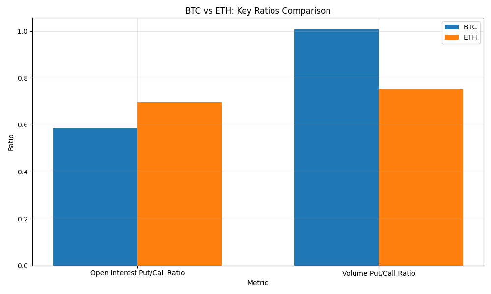
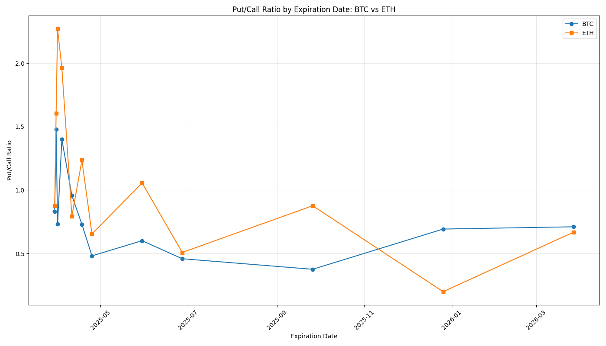

# Consolidated Crypto Options Summary - 2025-03-30

## Overview

This report provides a consolidated view of options data for Bitcoin (BTC) and Ethereum (ETH).

## Summary Statistics

| Metric | BTC | ETH |
|--------|-----|-----|
| Current Price | $82,492.38 | $1,841.08 |
| Total Open Interest | 198,018 | 1,274,524 |
| Calls Open Interest | 124,887 | 751,230 |
| Puts Open Interest | 73,131 | 523,294 |
| Put/Call Ratio | 0.59 | 0.70 |
| Total Volume | 15,397 | 97,034 |
| Calls Volume | 7,673 | 55,310 |
| Puts Volume | 7,724 | 41,724 |
| Volume Put/Call Ratio | 1.01 | 0.75 |
| Average IV | 5827.62% | 7591.84% |
| Min IV | 3178.00% | 4695.00% |
| Max IV | 11233.00% | 13120.00% |

## Implied Volatility Analysis

Implied volatility (IV) represents the market's expectation of future price movement and volatility. Higher IV indicates greater expected price movement and typically higher option premiums.

- **BTC Average IV**: 5827.62%
- **ETH Average IV**: 7591.84%

The IV spread between different strikes indicates market sentiment about potential price directions. A higher IV for out-of-the-money puts compared to calls suggests a bearish skew, while the opposite suggests a bullish skew.

### Volatility Surface Analysis

The volatility surface provides a comprehensive view of implied volatility across different strikes and expiration dates. This visualization helps identify potential trading opportunities and market inefficiencies.

## Comparison Charts

### BTC vs ETH: Key Ratios Comparison

### Put/Call Ratio by Expiration Date

## High Volume Strikes

### BTC High Volume Strikes

| Strike | Volume | Distance from Current Price |
|--------|--------|----------------------------|
| $80,000 | 1,768 | -3.02% |
| $84,000 | 1,357 | 1.83% |
| $85,000 | 1,329 | 3.04% |
| $90,000 | 1,146 | 9.10% |
| $82,000 | 982 | -0.60% |

### ETH High Volume Strikes

| Strike | Volume | Distance from Current Price |
|--------|--------|----------------------------|
| $1,700 | 13,000 | -7.66% |
| $2,000 | 8,961 | 8.63% |
| $1,900 | 8,113 | 3.20% |
| $1,800 | 7,361 | -2.23% |
| $1,850 | 6,576 | 0.48% |

## Put/Call Ratio by Expiration

### BTC Put/Call Ratio by Expiration

| Expiration Date | Put/Call Ratio |
|-----------------|----------------|
| 2025-03-30 | 0.83 |
| 2025-03-31 | 1.48 |
| 2025-04-01 | 0.73 |
| 2025-04-04 | 1.40 |
| 2025-04-11 | 0.96 |
| 2025-04-18 | 0.73 |
| 2025-04-25 | 0.48 |
| 2025-05-30 | 0.60 |
| 2025-06-27 | 0.46 |
| 2025-09-26 | 0.38 |
| 2025-12-26 | 0.69 |
| 2026-03-27 | 0.71 |

### ETH Put/Call Ratio by Expiration

| Expiration Date | Put/Call Ratio |
|-----------------|----------------|
| 2025-03-30 | 0.88 |
| 2025-03-31 | 1.60 |
| 2025-04-01 | 2.27 |
| 2025-04-04 | 1.96 |
| 2025-04-11 | 0.79 |
| 2025-04-18 | 1.24 |
| 2025-04-25 | 0.65 |
| 2025-05-30 | 1.06 |
| 2025-06-27 | 0.51 |
| 2025-09-26 | 0.88 |
| 2025-12-26 | 0.20 |
| 2026-03-27 | 0.67 |

---

Report generated on 2025-03-30 00:08:26
