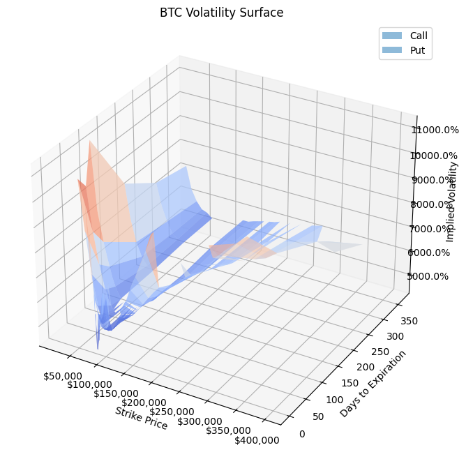
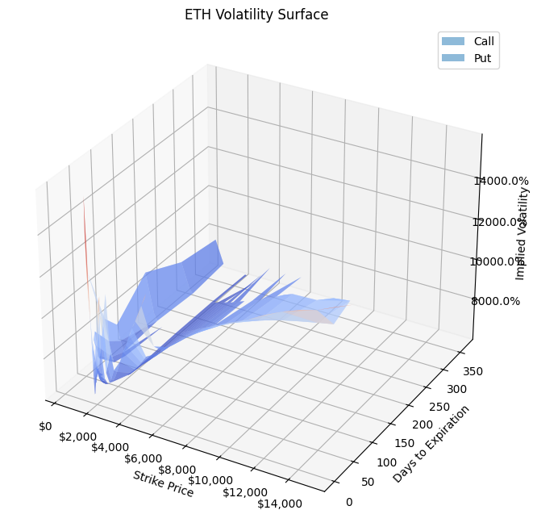
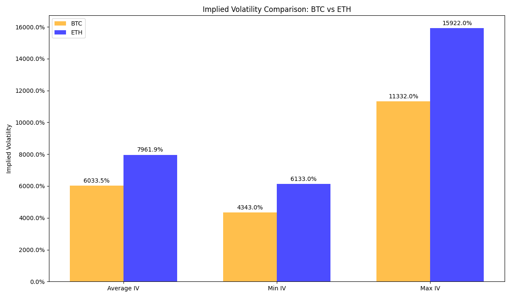
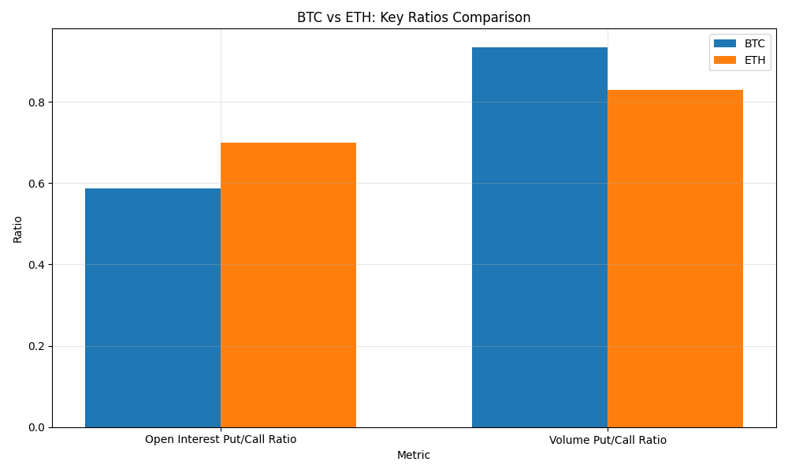
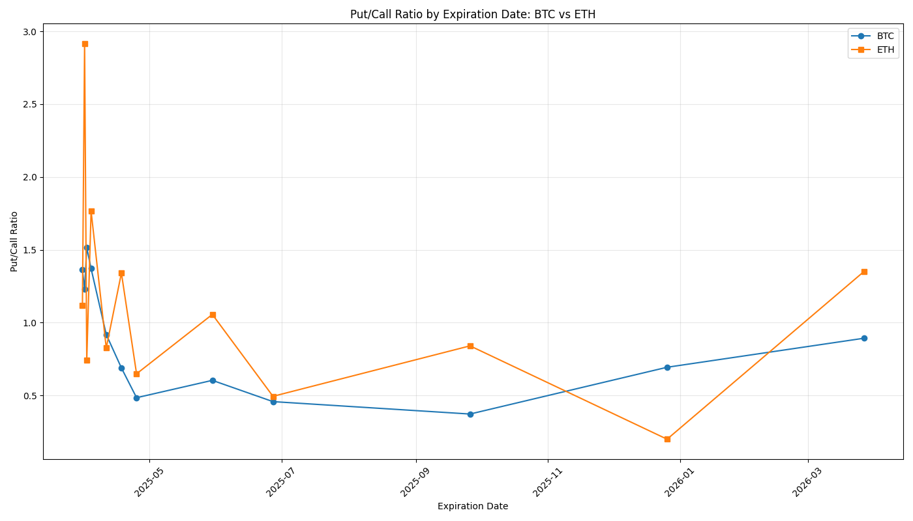

# Consolidated Crypto Options Summary - 2025-03-30

## Overview

This report provides a consolidated view of options data for Bitcoin (BTC) and Ethereum (ETH).

## Summary Statistics

| Metric | BTC | ETH |
|--------|-----|-----|
| Current Price | $82,761.55 | $1,812.16 |
| Total Open Interest | 198,006 | 1,322,663 |
| Calls Open Interest | 124,822 | 778,552 |
| Puts Open Interest | 73,184 | 544,111 |
| Put/Call Ratio | 0.59 | 0.70 |
| Total Volume | 5,814 | 107,425 |
| Calls Volume | 3,007 | 58,690 |
| Puts Volume | 2,807 | 48,735 |
| Volume Put/Call Ratio | 0.93 | 0.83 |
| Average IV | 6033.51% | 7961.88% |
| Min IV | 4343.00% | 6133.00% |
| Max IV | 11332.00% | 15922.00% |

## Implied Volatility Analysis

Implied volatility (IV) represents the market's expectation of future price movement and volatility. Higher IV indicates greater expected price movement and typically higher option premiums.

- **BTC Average IV**: 6033.51%
- **ETH Average IV**: 7961.88%

The IV spread between different strikes indicates market sentiment about potential price directions. A higher IV for out-of-the-money puts compared to calls suggests a bearish skew, while the opposite suggests a bullish skew.

### Volatility Surface Analysis

The volatility surface provides a comprehensive view of implied volatility across different strikes and expiration dates. This visualization helps identify potential trading opportunities and market inefficiencies.

#### Bitcoin (BTC) Volatility Surface

#### Ethereum (ETH) Volatility Surface

### Implied Volatility Comparison

## Comparison Charts

### BTC vs ETH: Key Ratios Comparison

### Put/Call Ratio by Expiration Date

## High Volume Strikes

### BTC High Volume Strikes

| Strike | Volume | Distance from Current Price |
|--------|--------|----------------------------|
| $80,000 | 606 | -3.34% |
| $78,000 | 523 | -5.75% |
| $86,000 | 365 | 3.91% |
| $82,000 | 359 | -0.92% |
| $76,000 | 335 | -8.17% |

### ETH High Volume Strikes

| Strike | Volume | Distance from Current Price |
|--------|--------|----------------------------|
| $1,800 | 29,732 | -0.67% |
| $1,700 | 11,761 | -6.19% |
| $2,000 | 8,225 | 10.37% |
| $1,600 | 6,808 | -11.71% |
| $1,750 | 6,045 | -3.43% |

## Put/Call Ratio by Expiration

### BTC Put/Call Ratio by Expiration

| Expiration Date | Put/Call Ratio |
|-----------------|----------------|
| 2025-03-31 | 1.36 |
| 2025-04-01 | 1.23 |
| 2025-04-02 | 1.52 |
| 2025-04-04 | 1.37 |
| 2025-04-11 | 0.92 |
| 2025-04-18 | 0.69 |
| 2025-04-25 | 0.48 |
| 2025-05-30 | 0.60 |
| 2025-06-27 | 0.46 |
| 2025-09-26 | 0.37 |
| 2025-12-26 | 0.69 |
| 2026-03-27 | 0.89 |

### ETH Put/Call Ratio by Expiration

| Expiration Date | Put/Call Ratio |
|-----------------|----------------|
| 2025-03-31 | 1.12 |
| 2025-04-01 | 2.92 |
| 2025-04-02 | 0.74 |
| 2025-04-04 | 1.77 |
| 2025-04-11 | 0.83 |
| 2025-04-18 | 1.34 |
| 2025-04-25 | 0.65 |
| 2025-05-30 | 1.06 |
| 2025-06-27 | 0.49 |
| 2025-09-26 | 0.84 |
| 2025-12-26 | 0.20 |
| 2026-03-27 | 1.35 |

---

Report generated on 2025-03-30 22:59:13
