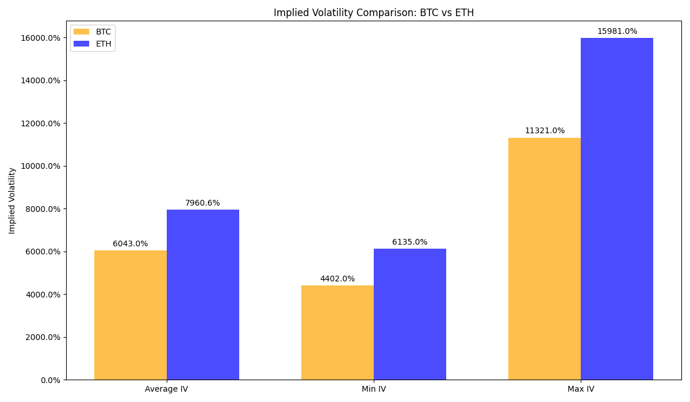
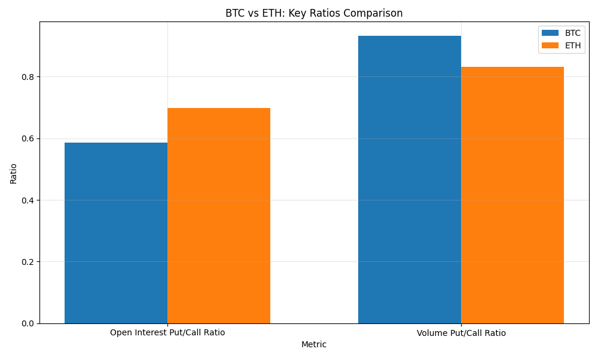
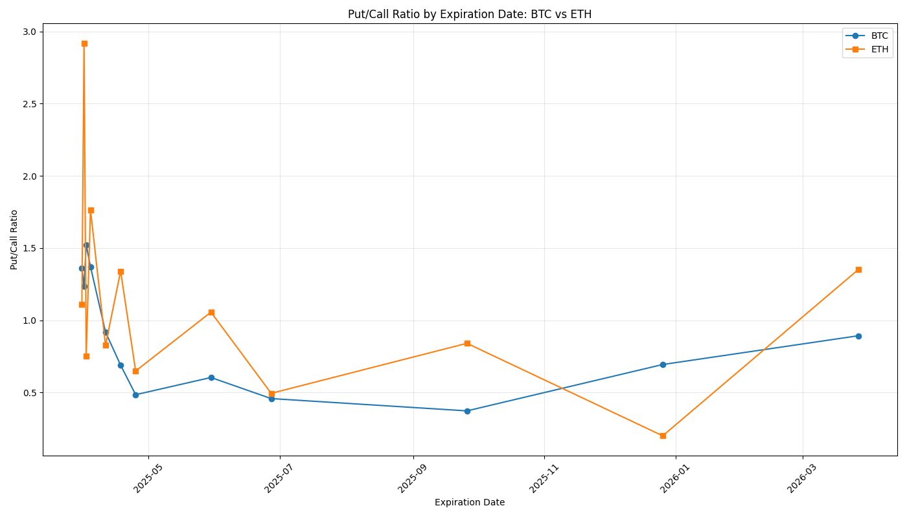

# Consolidated Crypto Options Summary - 2025-03-30

## Overview

This report provides a consolidated view of options data for Bitcoin (BTC) and Ethereum (ETH).

## Summary Statistics

|    | Metric                | BTC        | ETH       |
|---:|:----------------------|:-----------|:----------|
|  0 | Current Price         | $82,850.77 | $1,815.00 |
|  1 | Total Open Interest   | 198,026    | 1,322,753 |
|  2 | Calls Open Interest   | 124,827    | 778,615   |
|  3 | Puts Open Interest    | 73,199     | 544,138   |
|  4 | Put/Call Ratio        | 0.59       | 0.70      |
|  5 | Total Volume          | 5,839      | 107,260   |
|  6 | Calls Volume          | 3,023      | 58,575    |
|  7 | Puts Volume           | 2,816      | 48,685    |
|  8 | Volume Put/Call Ratio | 0.93       | 0.83      |
|  9 | Average IV            | 6043.03%   | 7960.64%  |
| 10 | Min IV                | 4402.00%   | 6135.00%  |
| 11 | Max IV                | 11321.00%  | 15981.00% |

## Implied Volatility Analysis

Implied volatility (IV) represents the market's expectation of future price movement and volatility. Higher IV indicates greater expected price movement and typically higher option premiums.

- **BTC Average IV**: 6043.03%
- **ETH Average IV**: 7960.64%

The IV spread between different strikes indicates market sentiment about potential price directions. A higher IV for out-of-the-money puts compared to calls suggests a bearish skew, while the opposite suggests a bullish skew.

### Volatility Skew Analytics

#### Bitcoin (BTC) Skew Analysis

**Put/Call Skew Metrics:**
- 25-Delta Put/Call Skew: 4.90%
- 10-Delta Put/Call Skew: 11.14%
- ATM Volatility: 49.61%
- Term Structure Slope: 6.25%

#### Ethereum (ETH) Skew Analysis

**Put/Call Skew Metrics:**
- 25-Delta Put/Call Skew: -1.21%
- 10-Delta Put/Call Skew: 18.37%
- ATM Volatility: 66.76%
- Term Structure Slope: -9.47%

### Volatility Surface Analysis

The volatility surface provides a comprehensive view of implied volatility across different strikes and expiration dates. This visualization helps identify potential trading opportunities and market inefficiencies.

#### Bitcoin (BTC) Volatility Surface

#### Ethereum (ETH) Volatility Surface

### Implied Volatility Comparison

### Volatility Skew Hotspots

#### BTC Volatility Hotspots
- Total hotspots identified: 126
- Maximum deviation: 73.51%
- Average deviation: 32.91%
- Call-side hotspots: 63
- Put-side hotspots: 63
- Most active strikes: $76,000.0, $85,000.0, $84,000.0, $84,500.0

#### ETH Volatility Hotspots
- Total hotspots identified: 128
- Maximum deviation: 72.41%
- Average deviation: 29.22%
- Call-side hotspots: 64
- Put-side hotspots: 64
- Most active strikes: $1,800.0, $2,000.0, $1,400.0, $1,900.0

## Comparison Charts

### BTC vs ETH: Key Ratios Comparison

### Put/Call Ratio by Expiration Date

## High Volume Strikes

### BTC High Volume Strikes

|    |   strike |   volume |   distance_pct | currency   |
|---:|---------:|---------:|---------------:|:-----------|
|  0 | 80000.00 |   608.30 |          -3.44 | BTC        |
|  1 | 78000.00 |   527.70 |          -5.85 | BTC        |
|  2 | 86000.00 |   364.70 |           3.80 | BTC        |
|  3 | 82000.00 |   351.30 |          -1.03 | BTC        |
|  4 | 76000.00 |   334.70 |          -8.27 | BTC        |

### ETH High Volume Strikes

|    |   strike |   volume |   distance_pct | currency   |
|---:|---------:|---------:|---------------:|:-----------|
|  0 |  1800.00 | 29742.00 |          -0.83 | ETH        |
|  1 |  1700.00 | 11751.00 |          -6.34 | ETH        |
|  2 |  2000.00 |  8204.00 |          10.19 | ETH        |
|  3 |  1600.00 |  6803.00 |         -11.85 | ETH        |
|  4 |  1750.00 |  6050.00 |          -3.58 | ETH        |

## Put/Call Ratio by Expiration

### BTC Put/Call Ratio by Expiration

|    | expiration_date   |   put_call_ratio | currency   |
|---:|:------------------|-----------------:|:-----------|
|  0 | 2025-03-31        |             1.36 | BTC        |
|  1 | 2025-04-01        |             1.23 | BTC        |
|  2 | 2025-04-02        |             1.52 | BTC        |
|  3 | 2025-04-04        |             1.37 | BTC        |
|  4 | 2025-04-11        |             0.92 | BTC        |
|  5 | 2025-04-18        |             0.69 | BTC        |
|  6 | 2025-04-25        |             0.48 | BTC        |
|  7 | 2025-05-30        |             0.60 | BTC        |
|  8 | 2025-06-27        |             0.46 | BTC        |
|  9 | 2025-09-26        |             0.37 | BTC        |
| 10 | 2025-12-26        |             0.69 | BTC        |
| 11 | 2026-03-27        |             0.89 | BTC        |

### ETH Put/Call Ratio by Expiration

|    | expiration_date   |   put_call_ratio | currency   |
|---:|:------------------|-----------------:|:-----------|
|  0 | 2025-03-31        |             1.11 | ETH        |
|  1 | 2025-04-01        |             2.92 | ETH        |
|  2 | 2025-04-02        |             0.75 | ETH        |
|  3 | 2025-04-04        |             1.77 | ETH        |
|  4 | 2025-04-11        |             0.83 | ETH        |
|  5 | 2025-04-18        |             1.34 | ETH        |
|  6 | 2025-04-25        |             0.65 | ETH        |
|  7 | 2025-05-30        |             1.06 | ETH        |
|  8 | 2025-06-27        |             0.49 | ETH        |
|  9 | 2025-09-26        |             0.84 | ETH        |
| 10 | 2025-12-26        |             0.20 | ETH        |
| 11 | 2026-03-27        |             1.35 | ETH        |

---

Report generated on 2025-03-30 23:10:49
