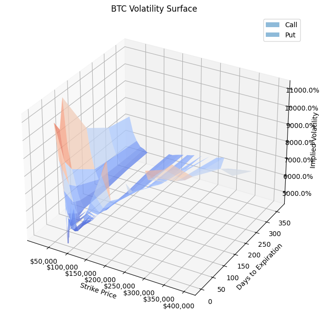
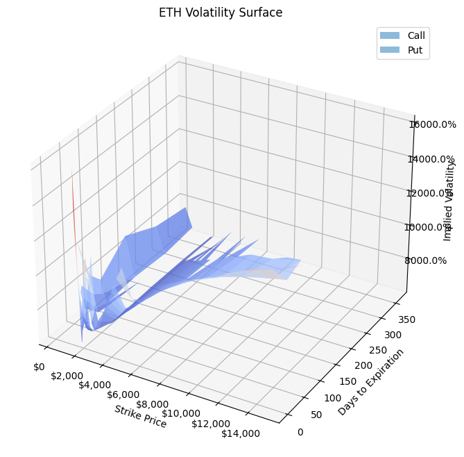
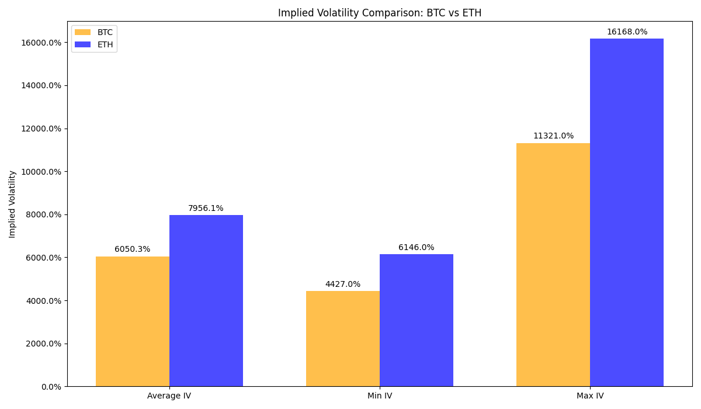
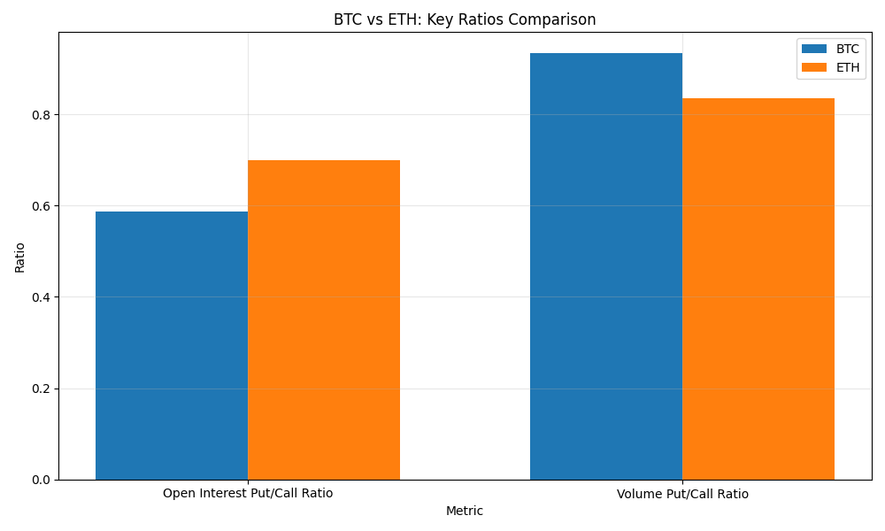
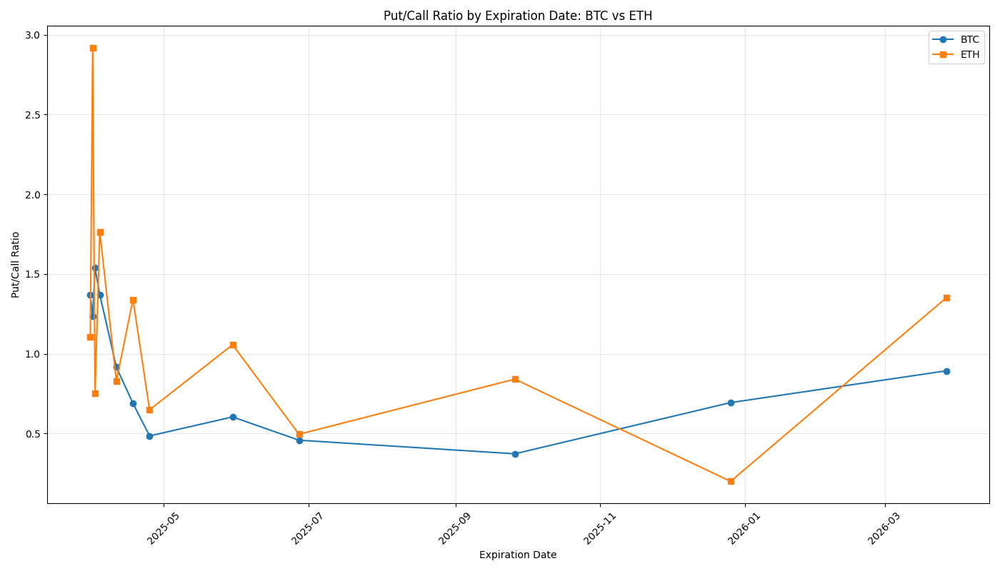

# Consolidated Crypto Options Summary - 2025-03-30

## Overview

This report provides a consolidated view of options data for Bitcoin (BTC) and Ethereum (ETH).

## Summary Statistics

|    | Metric                | BTC        | ETH       |
|---:|:----------------------|:-----------|:----------|
|  0 | Current Price         | $82,956.60 | $1,819.14 |
|  1 | Total Open Interest   | 198,054    | 1,323,127 |
|  2 | Calls Open Interest   | 124,841    | 778,679   |
|  3 | Puts Open Interest    | 73,213     | 544,448   |
|  4 | Put/Call Ratio        | 0.59       | 0.70      |
|  5 | Total Volume          | 5,857      | 107,517   |
|  6 | Calls Volume          | 3,029      | 58,562    |
|  7 | Puts Volume           | 2,828      | 48,955    |
|  8 | Volume Put/Call Ratio | 0.93       | 0.84      |
|  9 | Average IV            | 6050.31%   | 7956.12%  |
| 10 | Min IV                | 4427.00%   | 6146.00%  |
| 11 | Max IV                | 11321.00%  | 16168.00% |

## Implied Volatility Analysis

Implied volatility (IV) represents the market's expectation of future price movement and volatility. Higher IV indicates greater expected price movement and typically higher option premiums.

- **BTC Average IV**: 6050.31%
- **ETH Average IV**: 7956.12%

The IV spread between different strikes indicates market sentiment about potential price directions. A higher IV for out-of-the-money puts compared to calls suggests a bearish skew, while the opposite suggests a bullish skew.

### Volatility Skew Analytics

#### Bitcoin (BTC) Skew Analysis

**Put/Call Skew Metrics:**
- 25-Delta Put/Call Skew: 4.97%
- 10-Delta Put/Call Skew: 10.57%
- ATM Volatility: 49.63%
- Term Structure Slope: 4.88%

#### Ethereum (ETH) Skew Analysis

**Put/Call Skew Metrics:**
- 25-Delta Put/Call Skew: -1.19%
- 10-Delta Put/Call Skew: 16.85%
- ATM Volatility: 66.23%
- Term Structure Slope: -10.02%

### Volatility Surface Analysis

The volatility surface provides a comprehensive view of implied volatility across different strikes and expiration dates. This visualization helps identify potential trading opportunities and market inefficiencies.

#### Bitcoin (BTC) Volatility Surface

The BTC volatility surface shows the relationship between implied volatility, strike prices, and time to expiration. Areas of high implied volatility (peaks) indicate where the market expects significant price movement potential.

#### Ethereum (ETH) Volatility Surface

The ETH volatility surface illustrates the term structure and strike dependence of implied volatilities. Steeper sections suggest stronger directional expectations in those price regions.

### Implied Volatility Comparison

### Volatility Skew Hotspots

#### BTC Volatility Hotspots
- Total hotspots identified: 124
- Maximum deviation: 73.60%
- Average deviation: 33.36%
- Call-side hotspots: 62
- Put-side hotspots: 62
- Most active strikes: $76,000.0, $85,000.0, $84,000.0, $84,500.0

#### ETH Volatility Hotspots
- Total hotspots identified: 126
- Maximum deviation: 74.15%
- Average deviation: 29.54%
- Call-side hotspots: 63
- Put-side hotspots: 63
- Most active strikes: $1,800.0, $2,000.0, $1,400.0, $1,900.0

## Comparison Charts

### BTC vs ETH: Key Ratios Comparison

### Put/Call Ratio by Expiration Date

## High Volume Strikes

### BTC High Volume Strikes

|    |   strike |   volume |   distance_pct | currency   |
|---:|---------:|---------:|---------------:|:-----------|
|  0 | 80000.00 |   608.20 |          -3.56 | BTC        |
|  1 | 78000.00 |   527.70 |          -5.97 | BTC        |
|  2 | 86000.00 |   363.90 |           3.67 | BTC        |
|  3 | 82000.00 |   356.70 |          -1.15 | BTC        |
|  4 | 76000.00 |   334.70 |          -8.39 | BTC        |

### ETH High Volume Strikes

|    |   strike |   volume |   distance_pct | currency   |
|---:|---------:|---------:|---------------:|:-----------|
|  0 |  1800.00 | 29866.00 |          -1.05 | ETH        |
|  1 |  1700.00 | 11729.00 |          -6.55 | ETH        |
|  2 |  2000.00 |  8259.00 |           9.94 | ETH        |
|  3 |  1600.00 |  6793.00 |         -12.05 | ETH        |
|  4 |  1750.00 |  6015.00 |          -3.80 | ETH        |

## Put/Call Ratio by Expiration

### BTC Put/Call Ratio by Expiration

|    | expiration_date   |   put_call_ratio | currency   |
|---:|:------------------|-----------------:|:-----------|
|  0 | 2025-03-31        |             1.37 | BTC        |
|  1 | 2025-04-01        |             1.23 | BTC        |
|  2 | 2025-04-02        |             1.54 | BTC        |
|  3 | 2025-04-04        |             1.37 | BTC        |
|  4 | 2025-04-11        |             0.92 | BTC        |
|  5 | 2025-04-18        |             0.69 | BTC        |
|  6 | 2025-04-25        |             0.48 | BTC        |
|  7 | 2025-05-30        |             0.60 | BTC        |
|  8 | 2025-06-27        |             0.46 | BTC        |
|  9 | 2025-09-26        |             0.37 | BTC        |
| 10 | 2025-12-26        |             0.69 | BTC        |
| 11 | 2026-03-27        |             0.89 | BTC        |

### ETH Put/Call Ratio by Expiration

|    | expiration_date   |   put_call_ratio | currency   |
|---:|:------------------|-----------------:|:-----------|
|  0 | 2025-03-31        |             1.10 | ETH        |
|  1 | 2025-04-01        |             2.92 | ETH        |
|  2 | 2025-04-02        |             0.75 | ETH        |
|  3 | 2025-04-04        |             1.77 | ETH        |
|  4 | 2025-04-11        |             0.83 | ETH        |
|  5 | 2025-04-18        |             1.34 | ETH        |
|  6 | 2025-04-25        |             0.65 | ETH        |
|  7 | 2025-05-30        |             1.06 | ETH        |
|  8 | 2025-06-27        |             0.50 | ETH        |
|  9 | 2025-09-26        |             0.84 | ETH        |
| 10 | 2025-12-26        |             0.20 | ETH        |
| 11 | 2026-03-27        |             1.35 | ETH        |

---

Report generated on 2025-03-30 23:19:08
